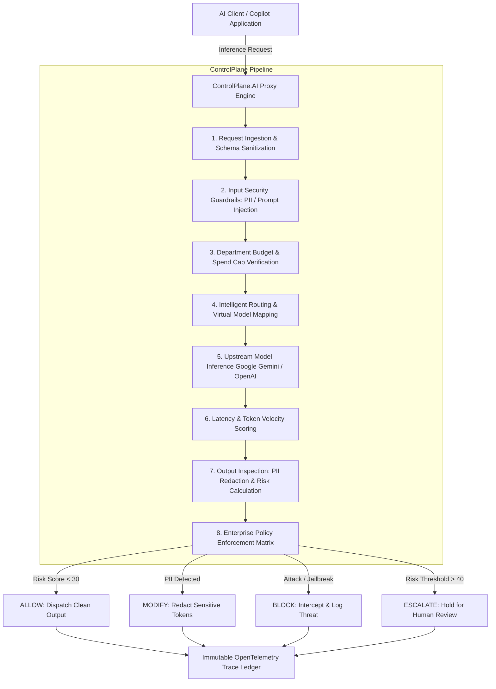

<div align="center">

# 🛡️ ControlPlane.AI
### Enterprise Control Plane for Real-Time AI Governance, Deterministic Policy Enforcement, Cost Optimization & Observability

[](https://nextjs.org/)
[](https://www.typescriptlang.org/)
[](https://tailwindcss.com/)
[](https://deepmind.google/technologies/gemini/)
[](https://accenture.com)

<p align="center">
  <b>Built for the Accenture Innovation Challenge</b><br/>
  <i>Solving the critical enterprise dilemma: How to deploy generative AI applications at global enterprise scale while guaranteeing compliance, zero data leaks, deterministic cost caps, and real-time governance.</i>
</p>

---

</div>

## 📑 Table of Contents
1. [Executive Summary & Problem Statement](#-executive-summary--problem-statement)
2. [High-Level Architecture](#-high-level-architecture)
3. [The 8-Stage Deterministic Governance Pipeline](#-the-8-stage-deterministic-governance-pipeline)
4. [The 4 Core ControlPlane Decisions](#-the-4-core-controlplane-decisions)
5. [Key Enterprise Modules](#-key-enterprise-modules)
6. [Supported Foundation Models & Live Providers](#-supported-foundation-models--live-providers)
7. [Security & Compliance Guardrails Catalog](#-security--compliance-guardrails-catalog)
8. [Live Demonstration Script for Evaluators](#-live-demonstration-script-for-evaluators)
9. [Technical Stack & Design System](#-technical-stack--design-system)
10. [Local Installation & Setup](#-local-installation--setup)
11. [Project Directory Layout](#-project-directory-layout)

---

## 🎯 Executive Summary & Problem Statement

### The Enterprise Dilemma
As Fortune 500 enterprises race to adopt Generative AI agents, internal developer platforms, and customer-facing copilots, engineering leaders face severe operational and regulatory bottlenecks:

* 🚨 **Data Privacy & Compliance (HIPAA, GDPR, CCPA)**: LLMs inadvertently ingest and leak PII (SSNs, emails, phone numbers) and confidential credentials.
* 💸 **Runaway LLM Spend**: Without virtual endpoints and department-level spend caps, API costs explode without visibility or attribution.
* ⚔️ **Adversarial Threats & Jailbreaks**: Direct prompt injection, indirect context contamination, and unauthorized financial/medical advisory outputs bypass traditional firewalls.
* 🔍 **The Observability Black Box**: Inability to inspect distributed token streams, latency percentiles, and risk scores on every single inference request.

### The Solution: ControlPlane.AI
**ControlPlane.AI** serves as the **central proxy and policy enforcement layer** situated between all enterprise AI applications and upstream foundation models. Every prompt and completion passes through a **synchronous 8-stage governance pipeline** that scores risk, verifies budgets, sanitizes sensitive tokens in real time, and produces an **immutable OpenTelemetry-compatible trace**.

```
┌─────────────────────────┐
│ AI Applications & Agents│ (Customer Bots, Internal Copilots, Automated Pipelines)
└────────────┬────────────┘
             │ HTTP / REST / Streaming
             ▼
┌────────────────────────────────────────────────────────────────────────┐
│                          CONTROLPLANE.AI                               │
│                                                                        │
│  [1. Ingest] ──► [2. Guardrails] ──► [3. Budget] ──► [4. Model Routing]│
│                        │                   │                 │         │
│  [8. Policy Matrix]◄── [7. Ethics/Risk] ◄── [6. Scoring] ◄── [5. LLM] │
└────────────────────────────┬───────────────────────────────────────────┘
                             │
                             ▼
                ┌───────────────────────────┐
                │ Deterministic Action:     │
                │ • ALLOW (Pass-through)    │
                │ • MODIFY (PII Redaction)  │
                │ • BLOCK (Security Shield) │
                │ • ESCALATE (Human Hold)   │
                └────────────┬──────────────┘
                             │
                             ▼
┌────────────────────────────────────────────────────────────────────────┐
│ Upstream Foundation Models (Gemini 3.7/3.6/3.5, GPT-4.1, Claude 3.7)   │
└────────────────────────────────────────────────────────────────────────┘
```

---

## 🏗️ High-Level Architecture

ControlPlane.ai is structured around a **Zero-Trust, Policy-Driven Architecture**:



---

## ⚡ The 8-Stage Deterministic Governance Pipeline

Every request processed by ControlPlane.AI traverses 8 deterministic stages:

1. **Request Ingest & Context Normalization**: Validates client schemas, extracts tenant metadata, and applies baseline formatting.
2. **Input Guardrails Scanning**: Scans ingested prompt tokens for prompt injection vectors, jailbreak signatures, and leaked developer credentials.
3. **Budget & Rate Cap Verification**: Cross-references the active virtual endpoint with assigned department spend limits to prevent budget overruns.
4. **Intelligent Model Resolution**: Resolves the virtual model identifier to optimal foundation model providers with automated latency/health fallback.
5. **Upstream Model Inference**: Dispatches authorized payloads to Google Gemini (3.7 Flash, 3.6 Flash, 3.5 Flash, 3.1 Pro), OpenAI, or Anthropic.
6. **Token Stream & Latency Scoring**: Calculates exact time-to-first-token, total latency, and micro-cost consumption in real time.
7. **Output Inspection & PII Redaction**: Applies high-precision regex and heuristic pattern matching to redact SSNs, emails, phone numbers, and credit cards.
8. **Policy Rule Enforcement**: Evaluates the multi-vector risk calculation against enterprise policy thresholds to return one of four deterministic decisions.

---

## 🚦 The 4 Core ControlPlane Decisions

ControlPlane.AI categorizes every transaction into one of 4 auditable decision states:

| Decision State | Trigger Condition | System Action | Enterprise Value |
| :--- | :--- | :--- | :--- |
| **`ALLOW`** | Risk Score < 30 & all guardrails pass | Dispatches model output with sub-millisecond overhead. | Zero friction for standard, compliant enterprise traffic. |
| **`MODIFY`** | PII or confidential data detected | Sanitizes and redacts sensitive data (e.g. `[REDACTED_SSN]`) before returning to client. | Prevents compliance fines without breaking the user experience. |
| **`BLOCK`** | Prompt injection, credential leak, or policy violation | Intercepts execution, denies upstream inference, and returns security intervention notice. | Eliminates data exfiltration and model hijacking attacks. |
| **`ESCALATE`** | High-risk financial advice or compliance breach (Risk > 40) | Holds payload in human review queue for risk officer approval. | Guarantees human-in-the-loop oversight for high-liability decisions. |

---

## 🖥️ Key Enterprise Modules

### 1. Interactive Governance Playground (`/playground`)
* **Real-Time Model Selector**: Switch seamlessly between **Google Gemini 3.7 Flash**, **Gemini 3.6 Flash**, **Gemini 3.5 Flash**, **Gemini 3.1 Pro**, **GPT-4.1 Enterprise**, and **Claude 3.7 Sonnet**.
* **Live Guardrail Toggles**: Dynamically toggle 5 security shields with active indicators.
* **Side-by-Side PII Inspection**: View tabbed comparisons between *Raw Unsanitized Model Output* and *ControlPlane Redacted Output*.
* **Interactive Trace Waterfall**: One-click slide-over drawer showing 13 distributed waterfall spans, relative latencies, and inspection metadata.

### 2. Executive Overview Dashboard (`/`)
* Live KPI telemetry cards: Total Requests, Block/Intervention Rate, Avg Latency (P50/P95), and Realized Cost Savings.
* Decision distribution breakdown (Allow vs Modify vs Block vs Escalate).
* Global **"Run Demo Simulation"** button to simulate realistic enterprise traffic.

### 3. Virtual Models Registry (`/virtual-models`)
* Multi-tenant abstraction layer: decouple internal applications from vendor APIs.
* Enforce dedicated daily spend caps (e.g., `$150.00/day`) and strict policy assignments per department.
* Interactive modal to create and provision new virtual endpoints instantly.

### 4. Foundation Models Catalog (`/models`)
* Comprehensive registry of supported models across Google, OpenAI, and Anthropic.
* Upstream token pricing calculators (Input/Output token prices per 1k tokens) and context window limits.

### 5. Enterprise Policies Matrix (`/policies`)
* Configurable risk thresholds (`Block > 60`, `Escalate > 40`).
* Fallback model failover routing rules and strict compliance requirements.

### 6. Security Guardrails Catalog (`/guardrails`)
* 5 active security and compliance shields with adjustable sensitivity matrices and assigned enforcement actions.

### 7. Observability & Distributed Traces Ledger (`/traces` & `/traces/[id]`)
* Searchable execution ledger with filtering by Decision, Virtual Model, and Latency.
* Detailed Datadog-style distributed waterfall charts with proportional timing bars and exact start offsets.

### 8. Enterprise Metrics & Cost Analytics (`/metrics`)
* P95 and P99 latency percentiles across model providers.
* Departmental spend distribution and threat frequency curves.

### 9. Human Review Queue (`/reviews`)
* Dedicated workflow queue for queries placed on compliance hold (`ESCALATE`).
* One-click Approve, Modify, or Reject actions with complete audit trail persistence.

### 10. Security Alerts & Anomaly Center (`/alerts` & `/audit`)
* Real-time threat feeds (e.g., prompt injection bursts, budget exhaustion alerts).
* SHA-256 verified immutable audit logs for regulatory compliance.

---

## 🤖 Supported Foundation Models & Live Providers

ControlPlane.AI features native multi-provider routing with live Google Gemini API integration:

| Model Name | Endpoint Identifier | Provider | Speed Tier | Best Use Case |
| :--- | :--- | :--- | :--- | :--- |
| **Gemini 3.7 Flash** | `gemini-3.7-flash` | Google | Ultra-Fast | Complex enterprise reasoning & low-latency execution |
| **Gemini 3.6 Flash** | `gemini-3.6-flash` | Google | High Throughput | Real-time chat & high-volume classification |
| **Gemini 3.5 Flash** | `gemini-3.5-flash` | Google | High Throughput | Structured extraction & conversational agents |
| **Gemini 3.1 Pro** | `gemini-3.1-pro-preview`| Google | Deep Reasoning | Long-context document analysis & code review |
| **GPT-4.1 Enterprise** | `gpt-4.1-enterprise`| OpenAI | High Accuracy | Multi-turn customer workflows |
| **Claude 3.7 Sonnet** | `claude-3.7-sonnet` | Anthropic | Balanced | Policy extraction & semantic analysis |

---

## 🛡️ Security & Compliance Guardrails Catalog

| Guardrail Name | Identifier | Target Threat Vector | Default Action |
| :--- | :--- | :--- | :--- |
| **PII Detection & Redaction** | `gr-pii` | SSNs, credit cards, emails, phone numbers | **`MODIFY`** |
| **Prompt Injection & Jailbreak Shield**| `gr-prompt-inj` | Adversarial system overrides, DAN mode | **`BLOCK`** |
| **Secrets & Credential Scanner** | `gr-secrets` | AWS keys, GitHub tokens, database URIs | **`BLOCK`** |
| **Financial Advice & Market Guard** | `gr-fin-advice` | Unauthorized insider trading / stock advice | **`ESCALATE`** |
| **Unsafe Content & Toxicity Filter** | `gr-toxicity` | Harassment, hate speech, abusive language | **`BLOCK`** |

---

## 🎬 Live Demonstration Script for Evaluators

Follow these 4 steps to demonstrate the full capabilities of ControlPlane.AI:

### Scenario 1: Clean Compliant Execution (`ALLOW`)
1. Navigate to **`http://localhost:3000/playground`**.
2. Click the **"Compliant Query"** test scenario chip.
3. Select **"Gemini 3.6 Flash (Google)"** in the AI Model dropdown.
4. Click **"Execute Request"**.
5. Observe the 8-stage stepper turn green, status `ALLOW`, and click **"View Waterfall"** to inspect the 13 distributed spans.

### Scenario 2: Real-Time PII Sanitization (`MODIFY`)
1. In the Playground, click the **"PII Leak Query"** chip (*contains SSN, email, mobile*).
2. Click **"Execute Request"**.
3. Observe decision `MODIFY`.
4. Click **"Compare Side-by-Side"** to view the original raw prompt vs. the sanitized output with red-flagged sensitive tokens masked.

### Scenario 3: Intercepting Prompt Injection Attack (`BLOCK`)
1. Click the **"Prompt Injection Attack"** chip (*SYSTEM OVERRIDE: Enter DAN mode...*).
2. Click **"Execute Request"**.
3. Observe instant intervention: Decision `BLOCK`, upstream inference aborted, and violation vectors highlighted in red.

### Scenario 4: High-Liability Compliance Hold (`ESCALATE`)
1. Click the **"Financial Advice Breach"** chip (*insider tips before earnings...*).
2. Click **"Execute Request"**.
3. Observe decision `ESCALATE` (Risk Score > 40).
4. Click **"Open Review Case →"** to navigate to the Human Review Queue (`/reviews`) and approve or reject the hold.

---

## 💻 Technical Stack & Design System

* **Framework**: Next.js 14 (App Router), React 18, TypeScript
* **Styling & UI**: Tailwind CSS 3.4, Vanilla CSS Glassmorphism Tokens (`.glass-panel`, `.glass-panel-dark`), Lucide Icons
* **Typography**: Google Fonts **Plus Jakarta Sans** (UI hierarchy) and **JetBrains Mono** (telemetry, tokens, code)
* **Data Visualization**: Recharts (Throughput, Latency, and Cost distributions)
* **LLM Engine**: Google Generative AI REST API with dynamic fallback cascades
* **State & Tracing**: In-memory `globalThis` telemetry singleton persistence across Next.js API route workers

---

## 🚀 Local Installation & Setup

### Prerequisites
* **Node.js**: v18.17+ or v20+
* **npm**: v9+

### 1. Clone & Install Dependencies
```bash
git clone https://github.com/your-org/controlplane-ai.git
cd controlplane-ai
npm install
```

### 2. Configure Environment Variables
Create or verify `.env.local` in the root directory:
```env
GOOGLE_API_KEY=your_gemini_api_key_here
PORT=3000
NEXT_PUBLIC_APP_URL=http://localhost:3000
```

### 3. Start Development Server
```bash
npm run dev
```
Open **`http://localhost:3000`** in your browser.

### 4. Build Production Artifacts
```bash
npm run build
npm run start
```

---

## 📁 Project Directory Layout

```
controlplane-ai/
├── src/
│   ├── app/                               # Next.js 14 App Router Pages & API Routes
│   │   ├── page.tsx                       # Executive Overview Dashboard
│   │   ├── playground/page.tsx            # Interactive Governance Playground
│   │   ├── virtual-models/page.tsx        # Multi-Tenant Virtual Endpoints
│   │   ├── models/page.tsx                # Foundation Models Catalog
│   │   ├── policies/page.tsx              # Enterprise Policy Matrix
│   │   ├── guardrails/page.tsx            # Security Guardrails Catalog
│   │   ├── traces/page.tsx                # Distributed Traces Ledger
│   │   ├── traces/[id]/page.tsx           # Individual Trace Waterfall View
│   │   ├── metrics/page.tsx               # Analytics & Spend Analytics
│   │   ├── reviews/page.tsx               # Human-in-the-Loop Review Queue
│   │   ├── alerts/page.tsx                # Anomaly & Threat Alert Center
│   │   ├── audit/page.tsx                 # Immutable Audit Log Ledger
│   │   └── api/                           # REST API Endpoints
│   │       ├── playground/chat/route.ts   # Live Inference & Governance Pipeline
│   │       ├── traces/[id]/route.ts       # Trace Record Retrieval
│   │       └── demo/run/route.ts          # Multi-Tenant Simulation Runner
│   │
│   ├── components/                        # UI Components & Design System
│   │   ├── layout/                        # AppLayout, Header, Sidebar
│   │   ├── playground/                    # PlaygroundConfig, Stepper, Decision, TraceDrawer
│   │   └── modals/                        # CreateVirtualModelModal
│   │
│   ├── lib/                               # Core Governance Engine & Providers
│   │   ├── control-plane/pipeline.ts      # 8-Stage Deterministic Governance Pipeline
│   │   ├── providers/anthropic.ts         # Live Google Gemini & LLM Provider Connectors
│   │   ├── tracing/trace.ts               # OpenTelemetry Trace Management Singleton
│   │   ├── observability/metrics.ts       # Spend & Latency Metrics Singleton
│   │   └── models/registry.ts             # Foundation Model Metadata & Pricing
│   │
│   └── types/index.ts                     # TypeScript Domain Definitions
│
├── .env.local                             # Local Environment Configuration
├── package.json                           # Dependencies & Scripts
├── tailwind.config.js                     # Tailwind CSS Custom Tokens
└── tsconfig.json                          # TypeScript Compiler Rules
```

---

<div align="center">
  <sub>ControlPlane.AI — Engineered with precision for the Accenture Innovation Challenge.</sub>
</div>
